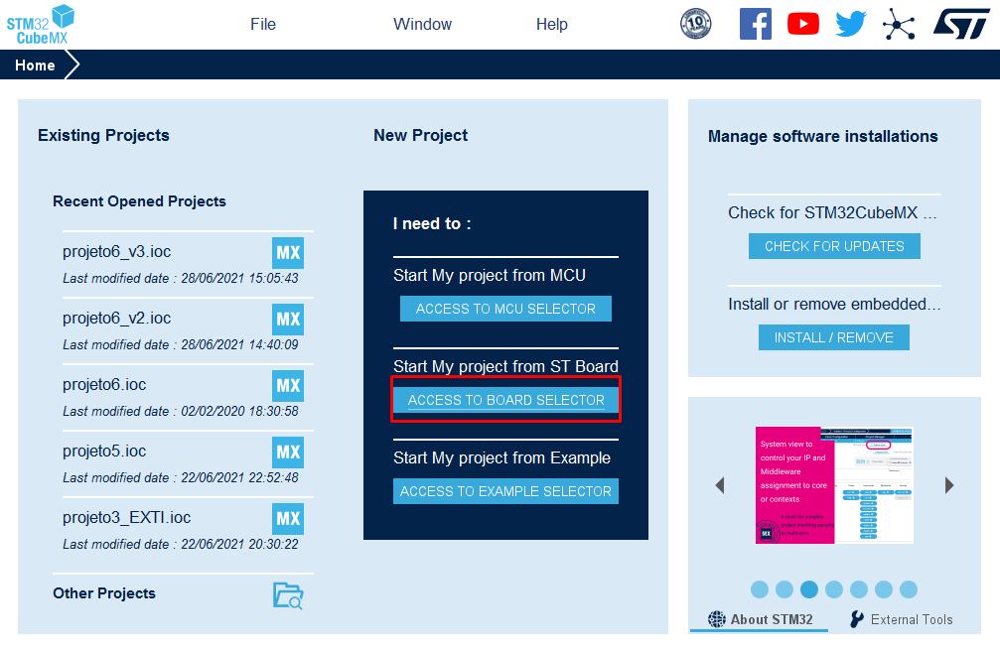

# API ServoTowerPro MG90D 360 
- Author: Rodrigo Drummond Lima

## Introduction
This API was developed as a project for the Embedded Systems Programming course at the Federal University of Minas Gerais (UFMG) in July 2021, with professor Ricardo de Oliveira Duarte.

The API contains functions to control a Servomotor Tower Pro MG90D. This hobby servo rotates 360 degrees and has continuous rotation. It means that the internal potentiometer that feedbacks the control system inside the motor is completely removed, so the PWM signal can only control the speed of the motor.

This API was developed and tested with the STM32-NUCLEO-F103RB board.

## Functions and objects:
### struct Servo
This is a struct that contains the timer and channel associated with the servo, the period of the PWM signal, in clock cycles, and the actual pulse width of the signal, in clock cycles. 

### void setPWM(TIM_HandleTypeDef timer, uint32_t channel, uint16_t period, uint16_t pulse);
This is a function made by professor Ricardo de Oliveira Duarte that initializes the PWM generation at the corresponding timer and channel with the specified period and pulse width, both in clock cycles.

### Servo initServo(TIM_HandleTypeDef timer, uint32_t channel, uint16_t period);
This function initializes the servo motor with the desired specifications and returns an object with those features.

### void setClockwiseSpeed(Servo S, float percent_speed);
This function makes the motor rotate clockwise with the desired percentage speed, relative to the nominal maximum speed. This function caps the speed at 110% to prevent damage to the motor.

### void setCounterClockwiseSpeed(Servo S, float percent_speed);
This function makes the motor rotate counterclockwise with the desired percentage speed, relative to the nominal maximum speed. This function caps the speed at 110% to prevent damage to the motor.

### void stopServo(Servo S);
This function simulates the motor braking, so it gradually reduces the speed until it stops.

## Application Example
In this example, it will be explained how to setup correctly the STM32CubeMX to use this API.
First, we need to choose a PWM frequency. For small hobby servos like this one, a frequency of 50Hz is usually chosen and the pulse width controls the speed and the rotation direction. The table below contains the information for the ServoTowerPro MG90D 360°.

Speed | Duty Cycle | Pulse Width (50Hz)
------------ | ------------- | -------------
Max. Clockwise | 0.0375 | 0.75 ms
Zero | 0.075 | 1.5 ms
Max. Counterclockwise | 0.1125 | 2.25 ms

### STMCubeMX configuration
First, you need to create a new project from a ST board

